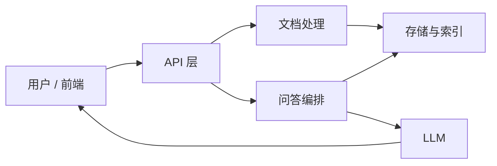
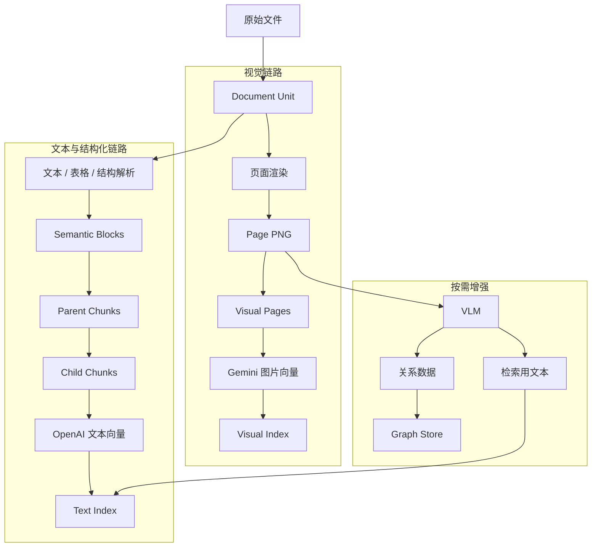
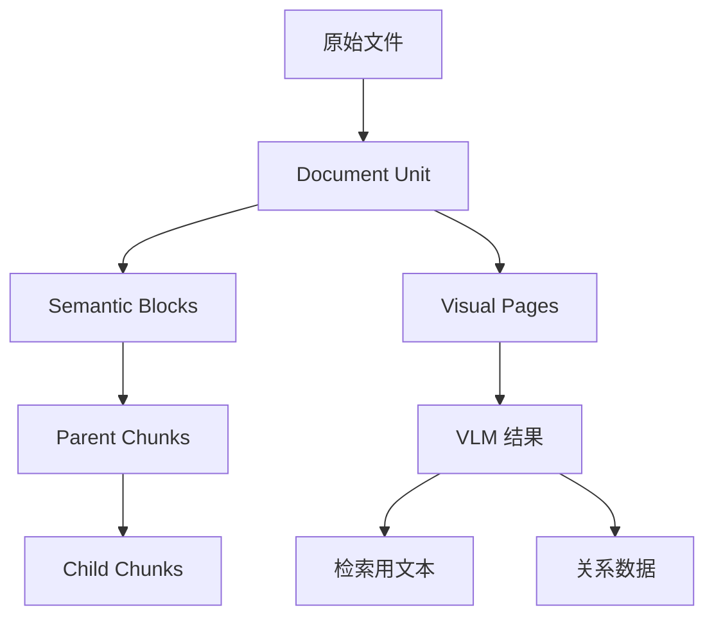
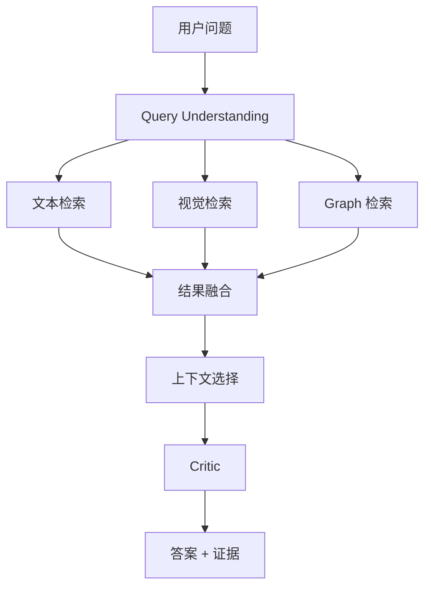
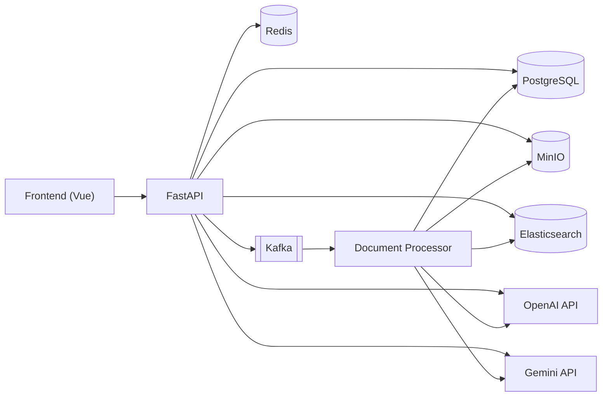
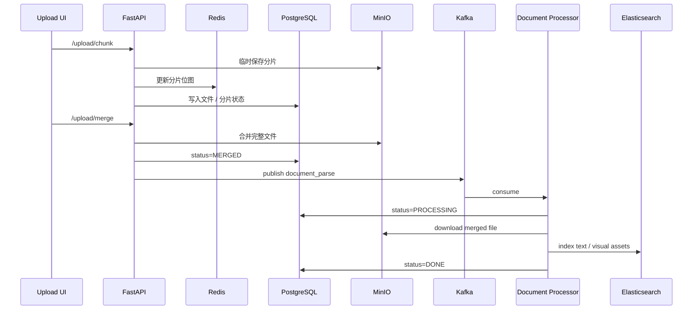
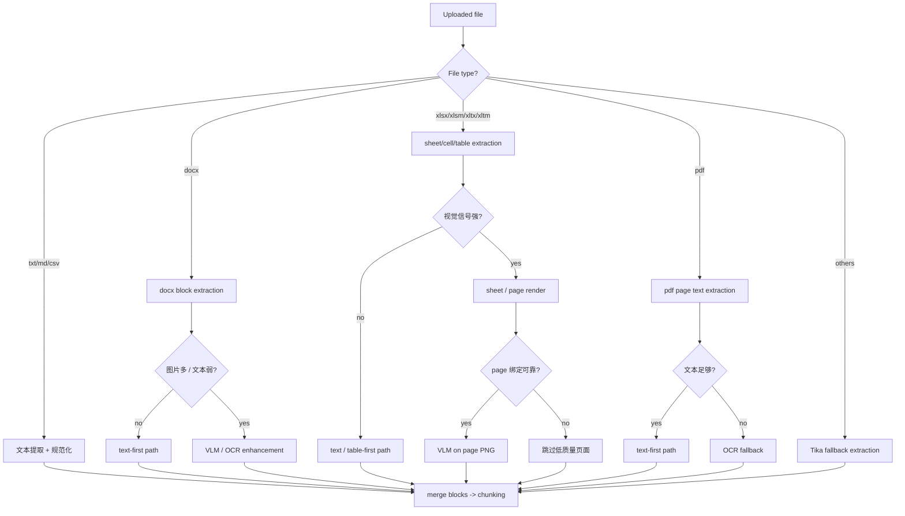
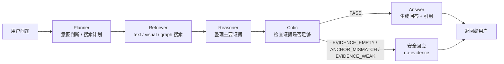
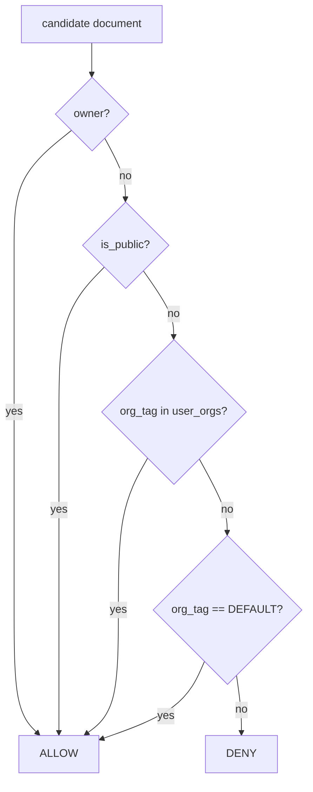

# AI 知识库基盘

[日本語](./README_ja.md) | [English](./README_en.md)

企业里的文档，不只是“文字”。很多关键内容其实在页面布局、流程关系、截图、Excel 设计表里。  
这个项目做的事情，就是把这些不同形态的信息放到同一个问答基盘里，让系统既能搜文本，也能找页面，还能理解关系。

---

## 项目简介

这里先把项目的用途、适用资料，以及它和普通 RAG 的差别讲清楚。  
如果你是第一次打开这个仓库，先看这一节就够了。

- 这是一个面向企业内部文档的多模态 AI 知识库基盘。
- 它读取 PDF、Word、Excel、PPT、图片，以及这些文件里的表格、页面、截图、流程图、画面迁移图。
- 它输出的不只是一个回答，还包括相关文本证据、页面图片证据，以及必要时的关系证据。
- 它和普通方案的差别在于：除了文本检索，还加入了页面级视觉检索、按需 VLM 增强，以及 Graph 检索。

---

## 输入与输出

这一部分只回答两个问题：系统接收什么输入，最后输出什么结果。  
先把这两件事看明白，后面的架构图会轻松很多。

### 输入

- 企业文档
- 设计书、运维手册
- 画面定义、画面迁移图
- Excel 设计资料
- 页面截图、流程图、图表

### 输出

- 带依据的问答结果
- 对应的文本证据
- 对应的页面图片
- 必要时的关系型证据

---

## 术语速览

后面会反复出现一些固定术语，这里先解释清楚。  
第一次看到 `chunk`、`Visual Page`、`Graph Facts` 这些词时，不会觉得跳。

| 术语 | 含义 |
|---|---|
| Document Unit | 文档里的原生单元，比如 page、sheet、section、slide |
| Semantic Block | 解析后的语义块，比如段落、表格行、摘要 |
| Parent Chunk | 回答时使用的大一点的上下文块 |
| Child Chunk | 检索时使用的小块 |
| Visual Page | 页面级图片对象，也就是 page-level PNG 资产 |
| Text Index | 文本检索索引 |
| Visual Index | 图片检索索引 |
| VLM | 看图并提取页面语义的模型 |
| Graph Facts | 从流程、关系、迁移信息里整理出来的 node / edge 数据 |
| Dynamic Context Selection | 根据问题类型，决定给 LLM 哪种证据组合 |

---

## 系统整体结构

这里先看系统的总体结构，不展开实现细节。  
第一张图只回答一个问题：这个项目大体由哪几块组成。



### 这张图怎么理解

- 用户通过前端和 API 交互。
- 文档上传后进入文档处理链路。
- 处理结果会进入存储、索引和图关系层。
- 用户提问时，问答编排层再去这些存储里取证据，最后交给 LLM 生成回答。

### 这张图下面对应的技术栈

- API / 后端：FastAPI
- 异步处理：Kafka
- 对象存储：MinIO
- 元数据与 ACL：PostgreSQL
- Graph：PostgreSQL + Apache AGE
- 检索索引：Elasticsearch
- 文本 embedding：OpenAI
- 图片 embedding：Gemini
- 页面理解：VLM

---

## 文档如何进入系统

这一部分说明：一份文档进来之后，会变成哪些可检索资产。  
这也是这个项目和普通“只切文本”的方案差别最大的地方。



### 这里最重要的两点

1. 所有文档尽量先统一成 page-level PNG，这样视觉检索才有稳定的基础。  
2. VLM 不是前提，而是增强层。先有视觉链路，再对需要的页面做额外理解。

---

## 系统里的数据是怎么分层的

这里说明：为什么项目里不是直接“文件 -> 向量”，而是中间有 block、chunk、visual page 这些层。  
这些层不是为了复杂，而是为了让不同类型的信息各自找到最合适的表示方式。



### 为什么要这样分层

- `Document Unit` 保留原始位置，比如 page、sheet。
- `Semantic Block` 表示最小语义单元，比如段落、表格行。
- `Child Chunk` 负责精确检索。
- `Parent Chunk` 负责回答时补更大的上下文。
- `Visual Page` 负责页面级视觉资产。
- VLM 结果不会直接混进所有链路，而是按用途分流到文本和 Graph。

---

## 一次提问是怎么完成的

这里说明：用户问一个问题之后，系统具体怎么把答案组织出来。  
关键不在“检索一下就结束”，而在多路证据要先融合，再决定给 LLM 什么。



### 这张图的重点

- 一个问题会同时走文本、视觉、Graph 三路检索。
- 检索结果不会直接原封不动丢给 LLM。
- 系统会先融合，再根据问题类型决定要给文本、图片、Graph 中的哪几种证据。

### 上下文选择大致怎么分

- 事实问答：偏文本
- 页面布局问题：偏文本 + 图片
- 关系问题：偏 Graph + 文本
- 明确要求看图时：再把图片一起带上

---

## 为什么不把所有东西都交给一个模型

这里解释：为什么系统看起来比“直接上一个大模型”更复杂。  
原因也很实际：企业文档里的信息类型差别太大，一种办法通常处理不好所有情况。

- 文字、字段、规则说明，更适合文本链路。
- 页面布局、截图、流程图，更适合视觉链路。
- 迁移关系、依赖关系，更适合 Graph。
- VLM 适合做增强，但不适合拿来替代所有解析。

这个项目的思路不是“让一个模型包打天下”，而是让不同类型的信息走最适合自己的链路，最后再汇总到问答层。

---

## 主要技术栈

这一部分把技术栈单独列出来，不把图塞满。  
想快速知道系统建在什么之上，直接看这里就可以。

- API / backend：FastAPI、WebSocket
- 异步处理：Kafka
- 元数据 / ACL / 状态：PostgreSQL
- Graph：PostgreSQL + Apache AGE
- 对象存储：MinIO
- 缓存：Redis
- 检索：Elasticsearch
- 文本 embedding：OpenAI
- 图片 embedding：Gemini
- 页面理解：VLM
- 运行方式：Docker、Docker Compose

---

## 快速开始

这里只放第一次把项目跑起来最少需要知道的步骤。  
更多配置细节放到 `.env.example` 和其他文档里，不在这里展开。

### 1. 复制配置

```bash
cp .env.example .env
```

### 2. 至少补这些配置

- `OPENAI_API_KEY`
- `GEMINI_API_KEY`
- 数据库 / Redis / MinIO / Elasticsearch 密码

> 不要把 `.env` 提交到 Git。真实密钥只保留在本地。

### 3. 启动服务

```bash
cd app
./start_docker.sh pg up
```

### 4. 检查服务是否正常

```bash
curl http://localhost:8000/health
```

### 5. 停止服务

```bash
cd app
./start_docker.sh pg down
```

---

## 常用环境变量

这里先列最常用、也最值得先看的变量。  
第一次本地运行时，通常不需要一口气理解所有配置。

### 文本 / 聊天

- `OPENAI_API_KEY`
- `OPENAI_EMBEDDING_MODEL`
- `OPENAI_CHAT_MODEL`

### 图片向量

- `GEMINI_VISUAL_EMBEDDING_ENABLED`
- `GEMINI_VISUAL_EMBEDDING_BACKEND=ai_studio|vertex|auto`
- `GEMINI_VISUAL_EMBEDDING_MODEL`
- `GEMINI_VISUAL_EMBEDDING_DIMENSIONS`
- `GEMINI_API_KEY`

### Graph

- `GRAPH_BACKEND=postgres_relational|postgres_age`
- `POSTGRES_AGE_ENABLED=true|false`
- `POSTGRES_AGE_GRAPH_NAME=knowledge_graph`

---

## 当前进展

这里说明：项目现在已经做到什么程度。  
如果你是来评估项目状态的，这一节最有用。

### 已经跑通

- 文本检索链路可用
- 页面级视觉对象和视觉向量链路可用
- Gemini 图片向量可用
- VLM 结果已能分流到文本与 Graph 相关数据
- PostgreSQL + AGE Graph backend 已可用
- 动态上下文选择已接入

### 后续值得继续做的

- 让 quality status 更强地参与召回过滤
- 继续稳定更多文档类型的 page-level render
- 让 Graph retrieval 更进一步进入主路径
- 补全评估和回归体系

---

## 进阶架构说明

前面的内容主要是帮助第一次看项目的人快速建立整体印象。  
如果你是来做面试准备、技术评审或者架构讨论，这一节开始会更偏设计意图、职责划分和取舍。

### 设计目标

- 从文档上传到问答返回，提供一条完整链路
- 在检索阶段强制执行权限边界
- 让画面布局、流程图、截图类资料也能进入问答
- 让系统后续可以做评估、回归和持续优化

### 更完整的系统架构

这一张图比前面的高层图更细，适合讲系统里的主要基础设施。  
它回答的是：API、异步处理、存储、索引和模型服务到底怎么分工。



### 上传与解析流程

这一段回答：文件上传后，系统内部怎么把它变成可处理任务。  
这里保留异步链路，是因为文档解析往往比较重，不适合同步压在 API 请求里。



### 这里的主要取舍

- 解析不走同步，而是走 Kafka 异步：
  - API 更轻，不容易因为长文档超时
- PostgreSQL 和 Elasticsearch 分工：
  - PostgreSQL 管元数据、状态、ACL、审计
  - Elasticsearch 管检索性能

### 文件类型与解析策略

| 类型 | 典型扩展名 | 主策略 | 补充说明 |
|---|---|---|---|
| Plain text | `txt`, `md`, `csv` | 文本提取 + 规范化 | 轻量、快速 |
| Office text | `docx` | block 提取 + 必要时 VLM / OCR | 表和段落优先 |
| Spreadsheet | `xlsx`, `xlsm`, `xltx`, `xltm` | cell / table 提取 + 页面图 + 按需 VLM | 画面定义、迁移图的重要来源 |
| PDF | `pdf` | 页级文本提取 + 必要时 OCR | 文本层弱时补 OCR |
| Fallback | 其他格式 | Tika fallback | 最后兜底 |

### 解析路由

这一张图回答：系统什么时候走 text-first，什么时候补 OCR / VLM。  
核心原则是“先 text-first，必要时再补视觉增强”。



### Chunking 与结构化

- `chunk_size = 900`
- `chunk_overlap = 120`
- 目的：
  - 保住足够的上下文
  - 降低切块边界带来的信息损失

主要 block 类型：

| block/source type | 生成来源 | 用途 |
|---|---|---|
| `paragraph`, `section` | 正文抽取 | 一般问答 |
| `table_row`, `table_header` | xlsx / docx 表格 | 字段和条件查询 |
| `xlsx_image`, `vlm_sheet_snapshot`, `vlm_diagram` | 图片 / 页面图 / VLM | 布局、迁移图、图解说明 |
| `relation_node`, `relation_edge` | 图形和关系抽取 | 关系检索、迁移说明 |

### VLM 结果怎么处理

- VLM 结果不会整包直接进入检索
- 会拆成：
  - 原始 payload
  - 检索用文本
  - 关系数据
- `image_path`、`sheet/page/source_parser` 会保留，方便后续证据回溯

### 问答与检索主流程

这一部分保留问答编排的完整流程，适合面试或技术评审时讲。  
这里的关键不是“检索完就回答”，而是中间有计划、整理、检查三个步骤。



### 这一段为什么重要

- Planner：决定这次问题主要走哪几条检索链路
- Retriever：做 text / visual / graph 三路召回
- Reasoner：先整理证据，不让 LLM 直接吃原始结果
- Critic：在回答前做最后一轮证据检查

当前 Critic 主要会给出这些判定：

- `EVIDENCE_EMPTY`：没有找到足够证据
- `ANCHOR_MISMATCH`：问题对象和召回证据对不上
- `EVIDENCE_WEAK`：有证据，但强度还不够
- `PASS`：可以继续生成回答

### 权限模型（ACL）

系统在检索阶段就会做权限过滤，不是等回答生成后再拦。  
当前主要按下面几类范围判断：

- `owner`
- `public`
- `org`
- `default`



### Kafka 可靠性设计

- 同一 consumer group 下做并行处理
- 用 `file_md5 + user_id` 做处理锁
- 用 done marker 跳过重复消息
- 重试超限后进入 DLQ

主要目标：
- 避免重复索引
- 避免毒消息把主队列卡死

### 评估体系

系统当前的评估分两层：

1. 在线评估：
   - 来自真实问答日志
   - 看 no-evidence、error、latency、source count 等
2. 离线评估：
   - 用固定数据集回归
   - 看 recall、precision、faithfulness、completeness、coverage

这部分的意义是：后面继续调 text / visual / graph 融合时，不靠感觉改。

---

## 相关文档

如果你已经看懂这个 README，下一步可以看这些文件。  
它们更偏实现细节和专项说明。

- `docs/graph_store_zh.md`（Graph backend 补充说明，中文）
- `docs/architecture_ja.md`（日文架构补充）
- `docker-compose.postgresql.yml`
- `.env.example`

---

## 一句话总结

这是一个把**文本、页面图片、关系信息**统一到同一个企业知识库问答基盘里的项目。
