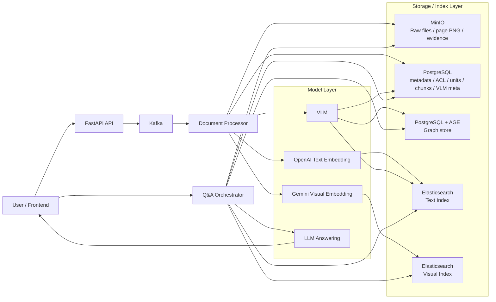
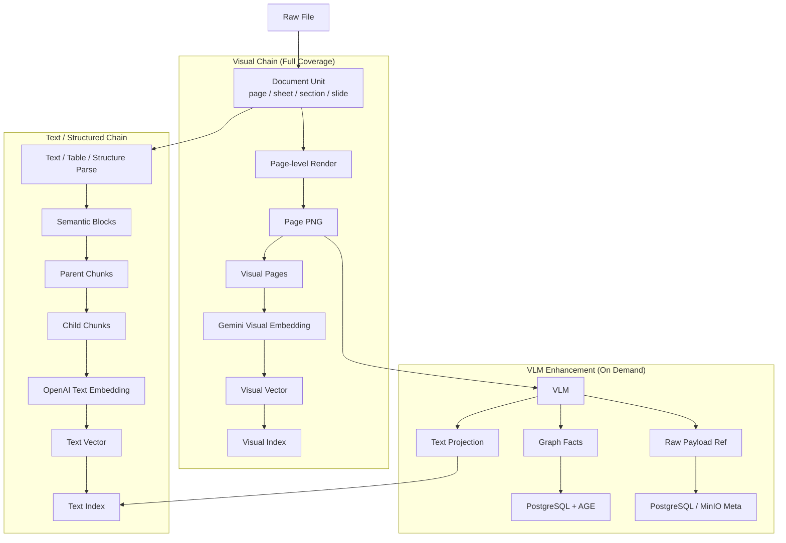
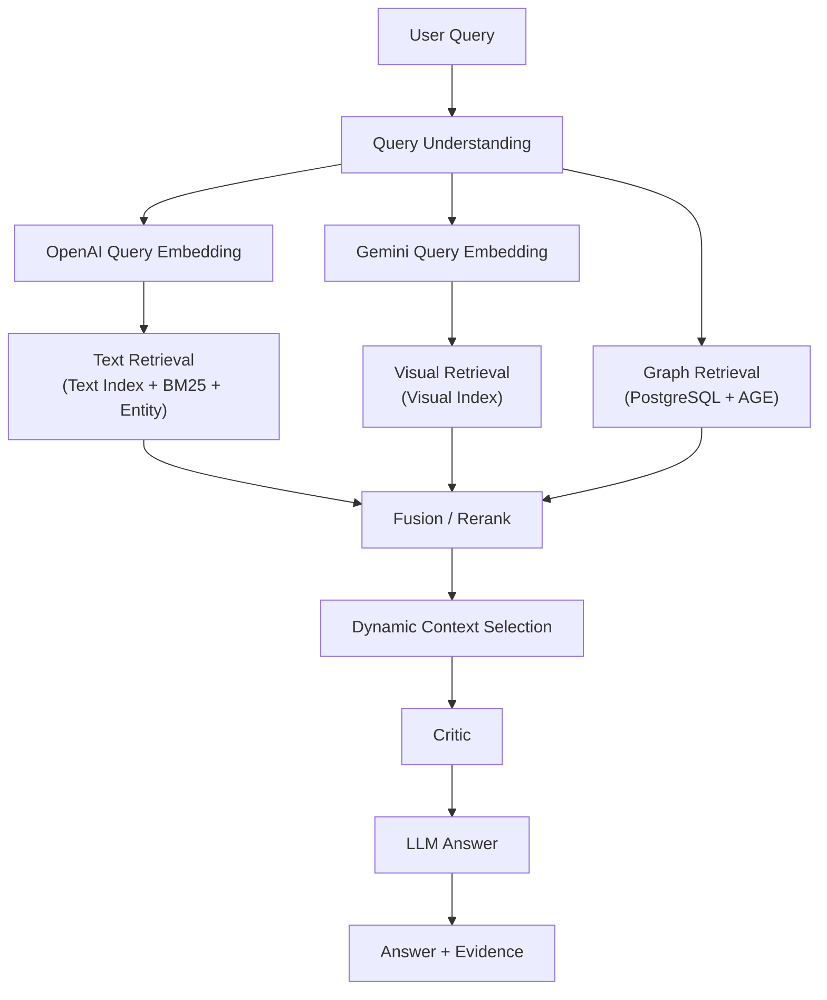

# AI Knowledge Base Platform

[日本語（詳細ガイド）](./README_ja.md) | [English](./README_en.md)

企業ドキュメントを `アップロード -> 解析・構造化 -> 検索 -> 根拠付き回答` まで一気通貫で扱う、オープンソースのナレッジ基盤です。  
現在の基盤は、**テキスト主導RAG** を維持しつつ、**全量ページ画像化による視覚検索**、**VLM増強**、**PostgreSQL + Apache AGE による graph 能力** を追加した構成になっています。

## Why This Project

企業の現場では、単純な全文検索やチャット型 RAG だけでは足りません。  
実際には、設計書・画面遷移図・画面レイアウト・表・手順書が混在し、しかも権限境界と説明責任があります。  
このプロジェクトは、次の 3 つを同時に満たす基盤を目指して設計しています。

- 文書をテキストだけでなく**ページ画像としても**検索できること
- 画像/レイアウト/遷移図は **VLM と graph** で補強できること
- 回答時に**根拠と証跡画像**を返せること

## Key Capabilities

- 分割アップロード + Kafka 非同期処理
- `PDF / Excel / Word / PPT` の page-level visual asset 化
- OpenAI による text embedding
- Gemini による visual embedding
- VLM による text projection / graph facts 生成
- Elasticsearch による text index / visual index
- PostgreSQL + Apache AGE による graph store
- `text + visual + graph` の三路検索
- 動的コンテキスト選択 (`text_only`, `text_plus_image`, `graph_plus_text`, `graph_plus_text_plus_image`)
- `owner/public/org/default` ベースのアクセス制御

## Core Architecture



## Dual Ingestion Pipelines

この基盤の特徴は、**視覚チェーン** と **テキスト/構造化チェーン** を並列で持つことです。  
VLM は視覚チェーンの前提ではなく、**必要なページにだけ追加される増強レイヤー**です。



## Retrieval and Answer Flow

質問は単一路線ではなく、`text / visual / graph` の三路で検索し、意図に応じて LLM に渡すコンテキストを切り替えます。



### Context Modes

- `fact_query -> text_only`
- `layout_query -> text_plus_image`
- `flow_query -> graph_plus_text`
- `visual-heavy / explicit image request -> graph_plus_text_plus_image`

## Current Stack

- API / Orchestration: `FastAPI`, `WebSocket`, `LangGraph`
- Async pipeline: `Kafka`
- Metadata / ACL / Chunks / VLM meta: `PostgreSQL`
- Graph store: `PostgreSQL + Apache AGE`
- Object storage: `MinIO`
- Search indexes: `Elasticsearch`
- Text embedding: `OpenAI`
- Visual embedding: `Gemini`
- Visual understanding: `VLM`

## Quick Start (Docker)

```bash
cp .env.example .env
# .env を編集（最低限 OPENAI_API_KEY / GEMINI_API_KEY / 各種パスワード）
cd app
./start_docker.sh pg up
```

Health check:

```bash
curl http://localhost:8000/health
```

Stop:

```bash
cd app
./start_docker.sh pg down
```

## Important Environment Variables

### Text / Chat

- `OPENAI_API_KEY`
- `OPENAI_EMBEDDING_MODEL`
- `OPENAI_CHAT_MODEL`

### Visual Embedding

- `GEMINI_VISUAL_EMBEDDING_ENABLED`
- `GEMINI_VISUAL_EMBEDDING_BACKEND=ai_studio|vertex|auto`
- `GEMINI_VISUAL_EMBEDDING_MODEL`
- `GEMINI_VISUAL_EMBEDDING_DIMENSIONS`
- `GEMINI_API_KEY` (AI Studio route)

### Graph

- `GRAPH_BACKEND=postgres_relational|postgres_age`
- `POSTGRES_AGE_ENABLED=true|false`
- `POSTGRES_AGE_GRAPH_NAME=knowledge_graph`

## Main Endpoints

- `POST /api/v1/auth/register`
- `POST /api/v1/auth/login`
- `POST /api/v1/upload/chunk`
- `POST /api/v1/upload/merge`
- `GET /api/v1/search/hybrid`
- `WS /api/v1/chat?token=...`

## Documents

- 日本語詳細ガイド: [README_ja.md](./README_ja.md)
- English guide: [README_en.md](./README_en.md)
- アーキテクチャ詳細: [docs/architecture_ja.md](./docs/architecture_ja.md)
- Graph 設計メモ: [docs/graph_store_zh.md](./docs/graph_store_zh.md)
- セキュリティ: [SECURITY.md](./SECURITY.md)
- コントリビュート: [CONTRIBUTING.md](./CONTRIBUTING.md)
- リリースノート: [RELEASE_NOTES.md](./RELEASE_NOTES.md)
