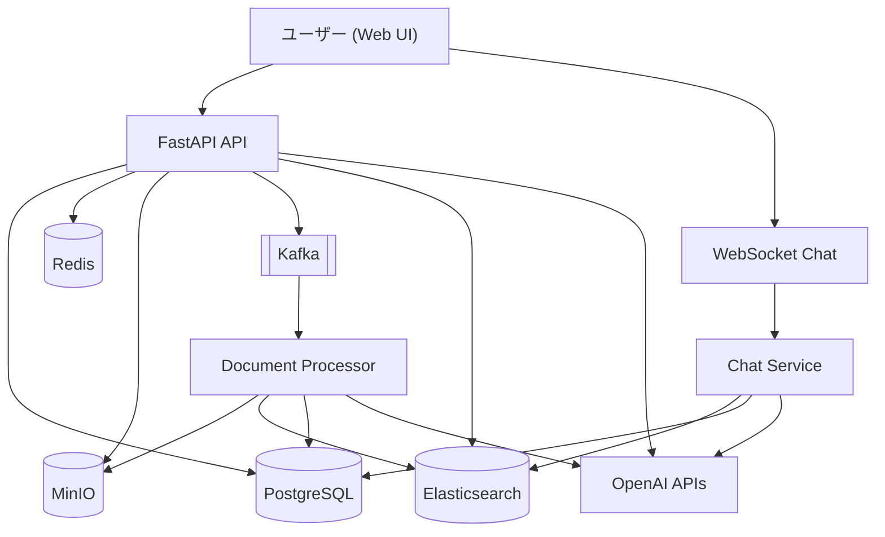
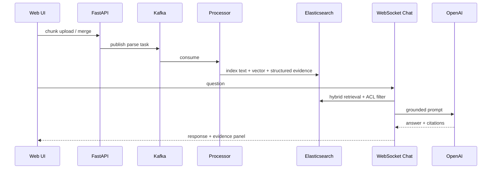

# AI Knowledge Base Platform

[日本語（このページ）](./README.md) | [English](./README_en.md)

企業ドキュメントを「アップロード -> 解析・構造化 -> 検索 -> 根拠付き回答」まで一気通貫で提供する、オープンソースのナレッジ基盤です。  
Kafka 非同期処理、Hybrid Retrieval、LangGraph 問答制御、組織ベース権限制御を実装しています。

## Why This Project (なぜ作ったか)

このプロジェクトを作った理由は、企業の現場で「検索できる」だけでは不十分だと感じたからです。  
実際には、設計書・手順書・画面遷移図が分散しており、必要な情報にたどり着くまで時間がかかります。さらに、権限境界があるため、一般的なチャット型RAGをそのまま導入すると、越権参照や説明不能な回答が運用リスクになります。  
そこで本基盤では、アップロードから解析・構造化・検索・回答までを一気通貫で設計し、検索段階で権限を強制し、回答には根拠リンクと画像証跡を返す方針にしました。  
狙いは「答えるAI」を作ることではなく、「企業で監査可能かつ継続運用できるナレッジ基盤」を作ることです。

## Key Capabilities

- 分割アップロード + 非同期解析で大きな文書にも対応
- 画像/図表を含む文書を構造化し、Q&Aで活用
- `vector + BM25 + relation` の混合検索
- `owner/public/org/default` のアクセス境界を検索段階で適用
- 回答に根拠リンクと画像証拠を添付
- 評価データを蓄積し、改善ループを回せる設計

## Core Architecture



## Upload -> Parse -> QA Flow



## LangGraph QA Orchestration

通常Q&Aは次の制御フローで実行されます。

```text
Planner -> Retriever -> Reasoner -> Critic -> Answer
```

Critic の主な判定コード:

- `EVIDENCE_EMPTY`
- `ANCHOR_MISMATCH`
- `EVIDENCE_WEAK`
- `PASS`

フロントには実行中ステータスを日本語で表示:

- `質問の意図を分析しています...`
- `根拠を検索しています...`
- `根拠を整理しています...`
- `回答の妥当性を確認しています...`
- `回答を生成しています...`

## Quick Start (Docker)

```bash
cp .env.example .env
# .env を編集（OPENAI_API_KEY、DB/Redis/MinIO パスワード等）
cd app
./start_docker.sh pg up
```

Health check:

```bash
curl http://localhost:8000/health
```

Stop:

```bash
cd app
./start_docker.sh pg down
```

## Main Endpoints

- `POST /api/v1/auth/register`
- `POST /api/v1/auth/login`
- `POST /api/v1/upload/chunk`
- `POST /api/v1/upload/merge`
- `GET /api/v1/search/hybrid`
- `WS /api/v1/chat?token=...`

## Documents

- 日本語利用ガイド（詳細）: [README_ja.md](./README_ja.md)
- 英語版利用ガイド: [README_en.md](./README_en.md)
- アーキテクチャ詳細: [docs/architecture_ja.md](./docs/architecture_ja.md)
- セキュリティ: [SECURITY.md](./SECURITY.md)
- コントリビュート: [CONTRIBUTING.md](./CONTRIBUTING.md)
- リリースノート: [RELEASE_NOTES.md](./RELEASE_NOTES.md)
