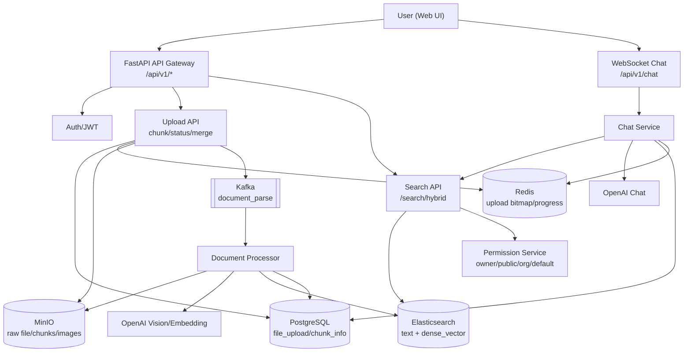
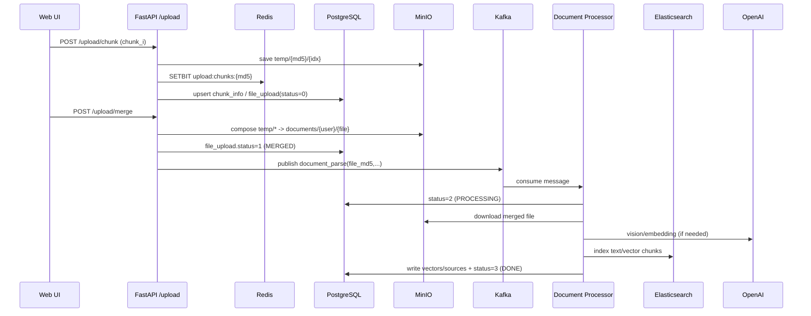
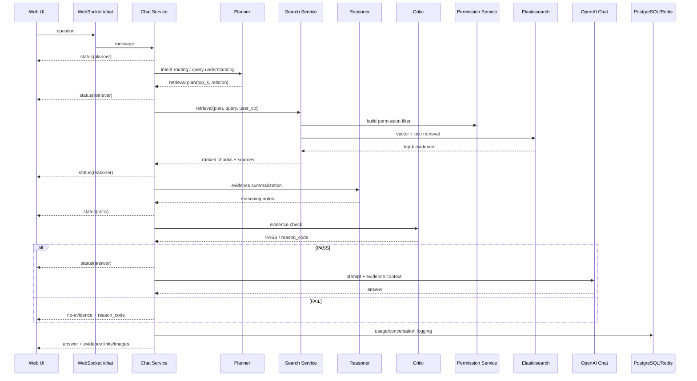
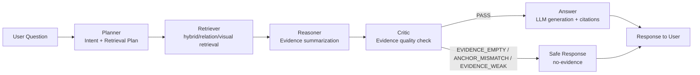

# AI Knowledge Base Platform

This document is the user-focused guide for international readers.  
For architecture/deep design review, see [docs/architecture_ja.md](./docs/architecture_ja.md).

## 1. What You Can Do
- Upload documents in chunks and process them asynchronously
- Parse image-heavy documents with VLM-assisted structuring
- Ask questions with hybrid retrieval (vector + full-text)
- Enforce access boundaries by owner/public/org/default
- Store evaluation data for continuous quality improvement

## 2. Typical Use Cases
- Cross-document search across design specs and operation manuals
- Organization-scoped knowledge sharing with access control
- Ongoing answer quality improvement using evaluation metrics

## 3. Quick Start (Docker)
1. Create config file:
```bash
cp .env.example .env
```
2. Edit `.env` (at minimum set `OPENAI_API_KEY` and passwords)
3. Start services:
```bash
cd app
./start_docker.sh pg up
```
4. Verify health:
```bash
docker ps --format "table {{.Names}}\t{{.Status}}"
curl http://localhost:8000/health
```
5. Stop services:
```bash
cd app
./start_docker.sh pg down
```

## 4. Minimal User Flow
1. Register account (org tags / primary org)
2. Upload documents (scope + org tag)
3. Ask in Knowledge Q&A
4. Verify answer with evidence links/images

## 5. System Overview


## 6. Main Flows

### 6.1 Upload -> Parse -> Index


### 6.2 Question -> Retrieve -> Answer


### 6.3 LangGraph QA Orchestration (New)
The default Q&A path is orchestrated with LangGraph using this pipeline:

```text
Planner -> Retriever -> Reasoner -> Critic -> Answer
```



- Planner:
  Detects intent and decides retrieval plan (`top_k`, relation on/off).
- Retriever:
  Executes existing hybrid/relation/visual-fallback retrieval logic.
- Reasoner:
  Summarizes top evidence before final answer generation.
- Critic:
  Validates evidence quality and can block unsafe/weak answers.
- Answer:
  Generates final answer when passed; otherwise returns safe no-evidence response.

Current Critic reason codes:
- `EVIDENCE_EMPTY`: no evidence found
- `ANCHOR_MISMATCH`: query anchors do not match retrieved evidence
- `EVIDENCE_WEAK`: evidence exists but confidence is too low
- `PASS`: answer can proceed

### 6.4 User-visible Stage Status (WebSocket)
During Q&A execution, the frontend shows Japanese stage messages:

- `質問の意図を分析しています...`
- `根拠を検索しています...`
- `根拠を整理しています...`
- `回答の妥当性を確認しています...`
- `回答を生成しています...`

If Critic blocks the answer, the UI also shows `reason_code` and reason text.

## 7. Key APIs
- `POST /api/v1/auth/register`
- `POST /api/v1/auth/login`
- `POST /api/v1/upload/chunk`
- `POST /api/v1/upload/merge`
- `GET /api/v1/search/hybrid`
- `WS /api/v1/chat?token=...`

## 8. Operational Notes
- Replace all secrets in `.env` before production use
- Default setup is single-node oriented
- Tune ES/Kafka/OpenAI parameters per data volume and latency targets
- Copy `.env.example` to `.env` before first run

## 9. Extra Documents
- Japanese user guide: [README_ja.md](./README_ja.md)
- Architecture notes: [docs/architecture_ja.md](./docs/architecture_ja.md)
- Security policy: [SECURITY.md](./SECURITY.md)
- Contributing guide: [CONTRIBUTING.md](./CONTRIBUTING.md)
- Release notes: [RELEASE_NOTES.md](./RELEASE_NOTES.md)
