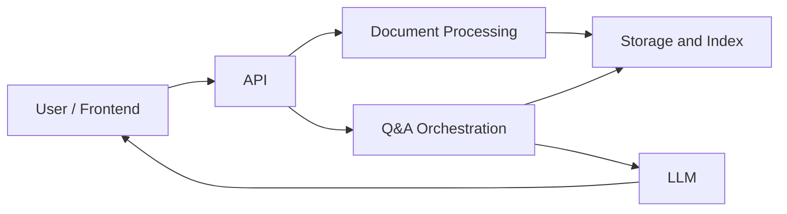
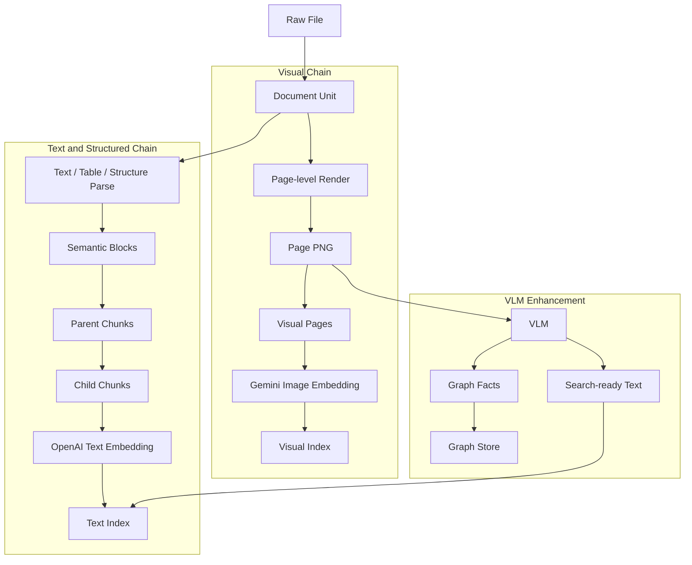
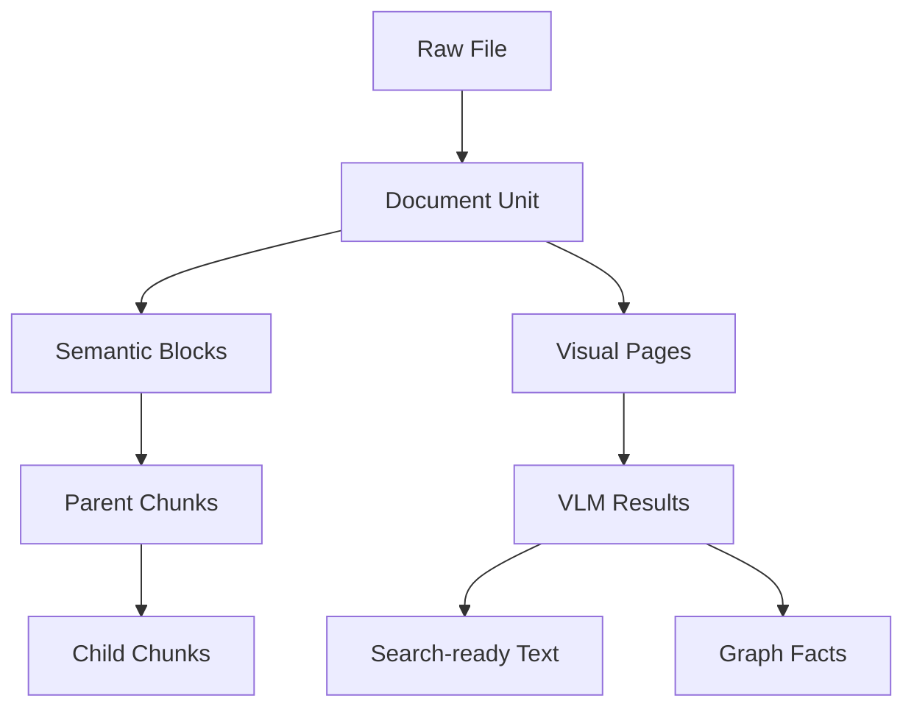
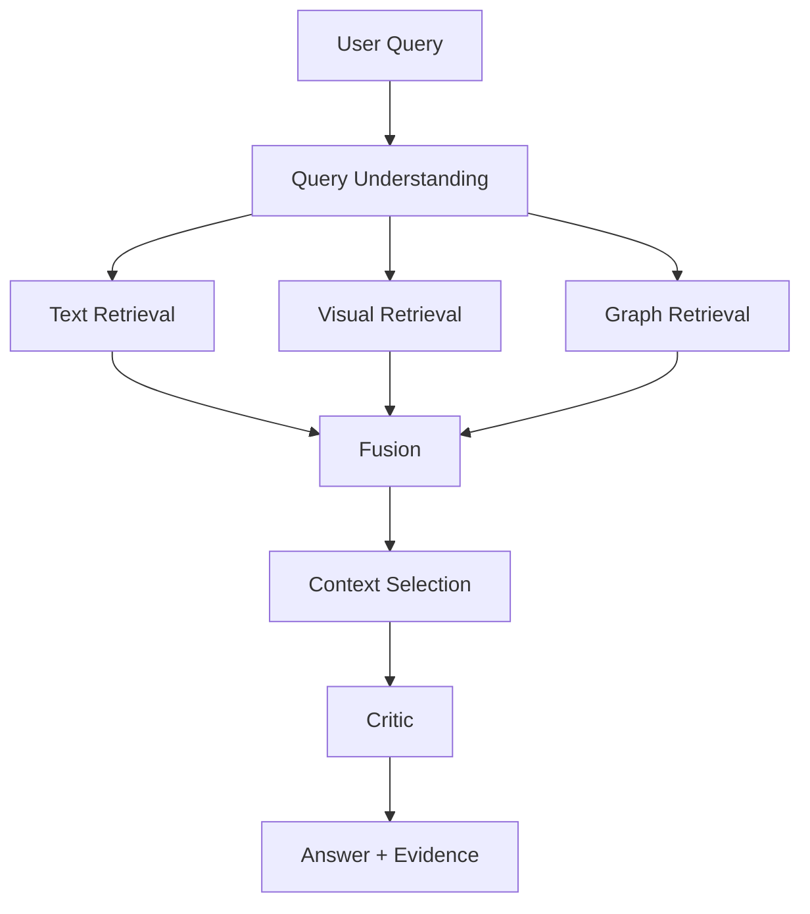
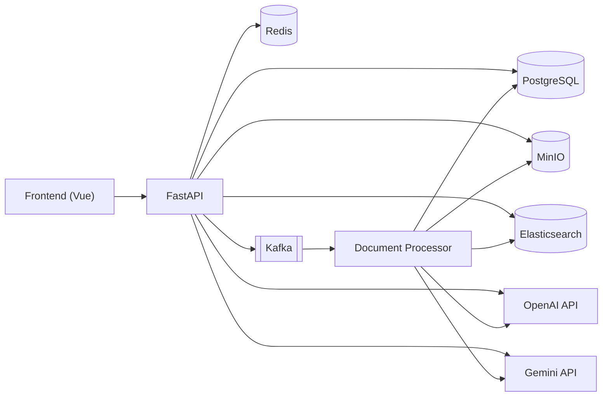
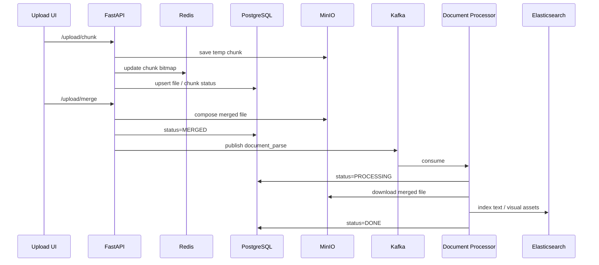
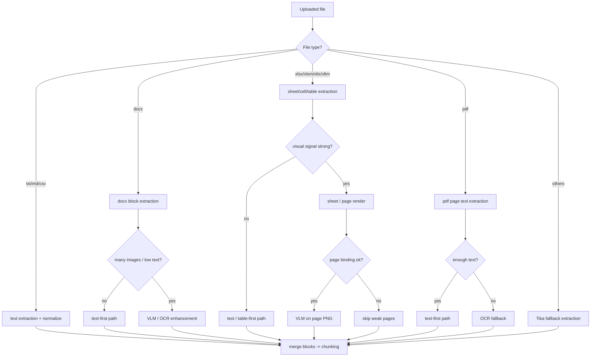
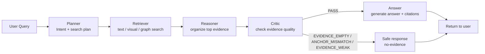
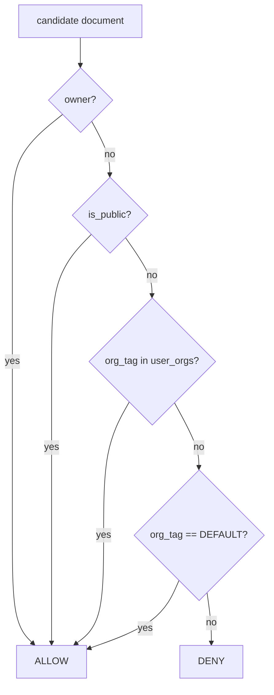

# AI Knowledge Base Platform

[中文](./README.md) | [日本語](./README_ja.md)

Enterprise documents are not just text. A lot of important information lives in layouts, screenshots, Excel sheets, and relationship diagrams.  
This project brings those different kinds of information into one Q&A platform so the system can search text, search pages, and reason over relationships together.

---

## What this project is

This section explains what the system actually does before going into implementation detail.  
If this is your first time here, this is the fastest way to understand how it differs from a standard RAG project.

- This is a multimodal AI knowledge base platform for enterprise documents.
- It reads PDF, Word, Excel, PPT, images, and the tables, pages, screenshots, flow diagrams, and screen transition diagrams inside them.
- It returns not only an answer, but also text evidence, page images, and graph evidence when needed.
- Unlike a standard “text chunks + embeddings + LLM” setup, it adds page-level visual retrieval, on-demand VLM enhancement, and graph retrieval.

---

## What goes in and what comes out

This section makes the inputs and outputs explicit.  
Once that is clear, the architecture diagrams are much easier to read.

### Input

- enterprise documents
- design specs and operation manuals
- screen definitions and transition diagrams
- Excel-based design sheets
- screenshots, flow diagrams, and charts

### Output

- evidence-grounded answers
- cited text evidence
- related page images
- graph evidence when the question needs it

---

## Quick glossary

This section explains the terms that appear repeatedly later.  
The goal is to make the rest of the README easier to follow on the first read.

| Term | Meaning |
|---|---|
| Document Unit | A native document unit such as a page, sheet, section, or slide |
| Semantic Block | A parsed semantic unit such as a paragraph, table row, or summary |
| Parent Chunk | A larger context unit used at answer time |
| Child Chunk | A smaller unit used for retrieval |
| Visual Page | A page-level image asset |
| Text Index | The index used for text retrieval |
| Visual Index | The index used for image retrieval |
| VLM | A vision-language model used to read page semantics |
| Graph Facts | Node / edge style relationship data extracted from content |
| Dynamic Context Selection | Choosing different evidence packages depending on the question |

---

## High-level system view

This section shows the system at a high level before going into details.  
The point here is to understand the major blocks, not every implementation choice.



### How to read this diagram

- Uploads go through the document processing path.
- Parsed results are stored in metadata, object storage, indexes, and graph storage.
- Questions go through the Q&A path, which gathers evidence and sends it to the LLM.

### Main technologies behind this diagram

- API / backend: FastAPI
- async processing: Kafka
- object storage: MinIO
- metadata and ACL: PostgreSQL
- graph: PostgreSQL + Apache AGE
- indexes: Elasticsearch
- text embeddings: OpenAI
- image embeddings: Gemini

---

## How a document becomes searchable

This section explains what one document turns into inside the platform.  
This is also where the biggest difference from a text-only RAG system becomes visible.



### The two key ideas in this diagram

1. The platform first tries to normalize documents into page-level PNGs, which becomes the foundation of the visual path.  
2. VLM is not the base layer. It is an enhancement used only when visual reasoning adds value.

---

## The internal data layers

This section explains why the system uses blocks, chunks, and visual pages instead of one flat document model.  
Those layers exist so different kinds of information can be represented in the form that fits them best.



### Why the system is layered this way

- Document Units keep the original page / sheet boundaries.
- Semantic Blocks hold the smallest semantic units.
- Child Chunks support precise retrieval.
- Parent Chunks support broader answer-time context.
- Visual Pages represent page-level visual assets.
- VLM output is split by purpose instead of being mixed into everything.

---

## What happens when a user asks a question

This section walks through the answer path.  
The important point is that retrieval results are not sent to the LLM as-is; they are first merged and filtered into the right evidence package.



### What this means in practice

- A question can trigger text, visual, and graph retrieval in parallel.
- Results are fused first, not passed directly to the LLM.
- The system then decides whether the answer should be built mostly from text, from text plus images, or from graph plus text.

---

## Why not hand everything to one model

This section explains why the system is intentionally structured this way.  
Enterprise documents mix very different kinds of information, and a single “send it all to one model” approach usually breaks down in cost, stability, and explainability.

- text-heavy questions are best handled on the text path
- page-heavy questions are better handled on the visual path
- relationship-heavy questions are better handled on the graph path
- VLM is useful, but not as a universal first step for everything

The design choice here is to route each type of information through the path where it behaves best, then combine the results later.

---

## Main technologies

The diagrams stay intentionally light, so the stack is listed here instead.  
If you want a quick technical summary, this is the section to look at.

- API / backend: FastAPI, WebSocket
- async processing: Kafka
- metadata / ACL / state: PostgreSQL
- graph: PostgreSQL + Apache AGE
- object storage: MinIO
- cache: Redis
- retrieval: Elasticsearch
- text embeddings and chat: OpenAI
- image embeddings: Gemini
- page understanding: VLM
- runtime: Docker, Docker Compose

---

## Quick start

This section only shows the minimum setup needed to run the project locally.  
More detailed configuration lives in `.env.example`.

### 1. Copy the config template

```bash
cp .env.example .env
```

### 2. Fill in at least these values

- `OPENAI_API_KEY`
- `GEMINI_API_KEY`
- passwords for DB / Redis / MinIO / Elasticsearch

> Do not commit `.env` to Git. Keep real secrets local only.

### 3. Start the services

```bash
cd app
./start_docker.sh pg up
```

### 4. Check health

```bash
curl http://localhost:8000/health
```

### 5. Stop the services

```bash
cd app
./start_docker.sh pg down
```

---

## Common environment variables

You do not need to understand every variable on day one.  
These are the ones most people care about first.

### Text / Chat

- `OPENAI_API_KEY`
- `OPENAI_EMBEDDING_MODEL`
- `OPENAI_CHAT_MODEL`

### Visual Embedding

- `GEMINI_VISUAL_EMBEDDING_ENABLED`
- `GEMINI_VISUAL_EMBEDDING_BACKEND=ai_studio|vertex|auto`
- `GEMINI_VISUAL_EMBEDDING_MODEL`
- `GEMINI_VISUAL_EMBEDDING_DIMENSIONS`
- `GEMINI_API_KEY`

### Graph

- `GRAPH_BACKEND=postgres_relational|postgres_age`
- `POSTGRES_AGE_ENABLED=true|false`
- `POSTGRES_AGE_GRAPH_NAME=knowledge_graph`

---

## Current status

This section gives a quick sense of what is already working.  
It is useful if you want to evaluate how far the current implementation has gone.

### Working now

- text retrieval pipeline
- page-level visual assets and image embeddings
- Gemini image embeddings
- VLM result routing into text and graph-related outputs
- PostgreSQL + AGE graph backend
- dynamic context selection

### Good next steps

- use quality status more aggressively in retrieval filtering
- stabilize page-level rendering across more document types
- bring graph retrieval further into the main path
- strengthen evaluation and regression coverage

---

## Architecture notes and trade-offs

The sections above are written for a first read.  
This section is for technical review, interviews, or anyone who wants to understand the design choices in more detail.

### Design goals

- Provide one continuous flow from upload to Q&A
- Enforce ACL boundaries at retrieval time
- Preserve answer quality even for image-heavy or diagram-heavy documents
- Keep the system measurable so quality can improve over time

### A more detailed system view

This diagram goes one level deeper than the first high-level diagram.  
It shows the main infrastructure pieces and how they connect without dropping all the way into implementation details.



### Upload / parse pipeline

This sequence focuses on what happens after a user uploads a file.  
The platform keeps parsing asynchronous because document processing can be heavy and long-running.



### Main trade-offs here

- Parsing is asynchronous through Kafka:
  - keeps API responses light
  - avoids long-request timeouts
- PostgreSQL and Elasticsearch are separated:
  - PostgreSQL handles metadata, state, ACL, and auditability
  - Elasticsearch handles retrieval performance

### Supported file types and parsing strategy

| Type | Typical extensions | Main strategy | Notes |
|---|---|---|---|
| Plain text | `txt`, `md`, `csv` | text extraction + normalization | lightweight and fast |
| Office text | `docx` | block extraction + optional VLM / OCR | paragraph and table oriented |
| Spreadsheet | `xlsx`, `xlsm`, `xltx`, `xltm` | cell / table extraction + page image + optional VLM | major source for layouts and transition docs |
| PDF | `pdf` | page text extraction + optional OCR | OCR fallback when text is weak |
| Fallback | other formats | Tika fallback | final safety net |

### Parsing routes

The default is text-first. OCR and VLM are only added when they clearly help.  
That keeps the platform cheaper and easier to reason about.



### Chunking and structuring

- `chunk_size = 900`
- `chunk_overlap = 120`
- goals:
  - preserve enough context
  - reduce boundary loss when content is split

Main block types:

| block/source type | Produced from | Used for |
|---|---|---|
| `paragraph`, `section` | body text extraction | general QA |
| `table_row`, `table_header` | xlsx / docx tables | field lookup, comparison |
| `xlsx_image`, `vlm_sheet_snapshot`, `vlm_diagram` | images / page PNG / VLM | layout, transition diagrams, visual explanation |
| `relation_node`, `relation_edge` | relation extraction | graph search, transition explanation |

### How VLM output is handled

- VLM output is not pushed into retrieval as one raw blob
- it is split by purpose:
  - raw payload
  - search-ready text
  - graph-oriented relationship data
- `image_path`, `sheet/page/source_parser` are kept for traceability and evidence display

### Q&A / retrieval orchestration

This is the answer path that is easiest to talk through in an interview or technical review.  
The key idea is that retrieval results are organized and checked before answer generation.



### What these stages are doing

- Planner:
  - decides which retrieval paths matter for this question
- Retriever:
  - runs text, visual, and graph retrieval
- Reasoner:
  - organizes evidence before generation
- Critic:
  - blocks weak answers when evidence is not good enough

The current Critic mainly returns these codes:

- `EVIDENCE_EMPTY`: not enough evidence was found
- `ANCHOR_MISMATCH`: the question target does not match the retrieved evidence
- `EVIDENCE_WEAK`: evidence exists, but it is still too weak
- `PASS`: answer generation can continue

### ACL model

ACL is enforced during retrieval, not after answer generation.  
The current logic checks these scopes with OR logic:

- `owner`
- `public`
- `org`
- `default`



### Kafka reliability design

- parallel consumers in one group
- processing lock by `file_md5 + user_id`
- done marker to skip duplicates
- DLQ after retry limit

Main goals:
- avoid duplicate indexing
- avoid letting poison messages block the main queue

### Evaluation model

The platform uses two evaluation layers:

1. Online evaluation
   - based on real usage logs
   - tracks no-evidence, error, latency, source count, and similar metrics
2. Offline evaluation
   - based on fixed datasets for regression checks
   - tracks recall, precision, faithfulness, completeness, and coverage

That split helps with both day-to-day observability and reproducible comparisons after changes.

---

## Related files

If you understand the README and want to go deeper, these are the next files to open.  
They are more implementation-oriented than this overview.

- `docs/graph_store_zh.md` (graph backend notes, Chinese)
- `docs/architecture_ja.md` (architecture notes, Japanese)
- `docker-compose.postgresql.yml`
- `.env.example`

---

## One-line summary

This project brings text, page images, and graph relationships into one enterprise knowledge platform.
