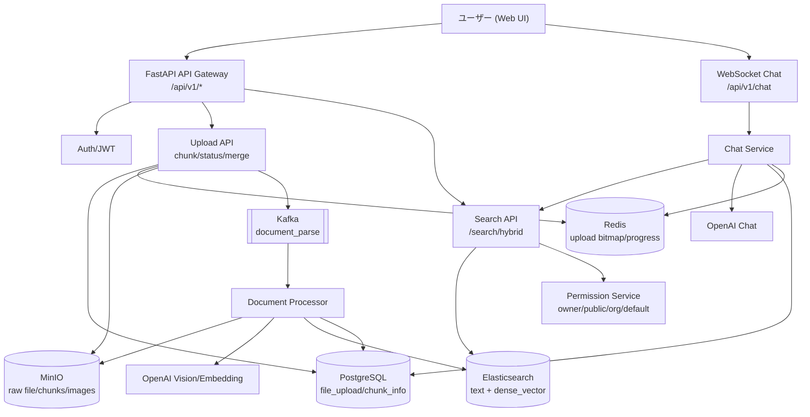
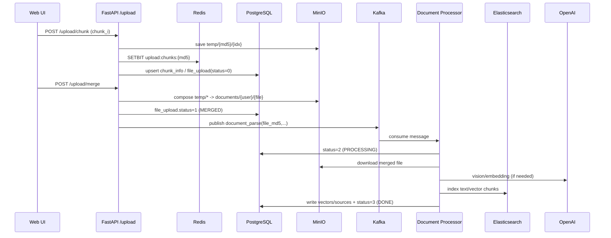
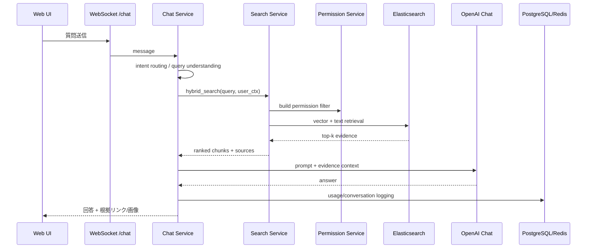

# AI Knowledge Base Platform

日本企業向けナレッジベース基盤のOSS実装です。  
このREADMEは「利用者向けガイド」として、セットアップと利用フローを最短で理解できる構成にしています。

## 1. できること
- ドキュメントを分割アップロードして非同期解析
- 画像/図表を含む文書を構造化して検索可能にする
- ハイブリッド検索（ベクトル + 全文）でQ&A
- 組織タグベースのアクセス制御（owner/public/org/default）
- 評価データを蓄積し、品質改善に活用

## 2. 想定ユースケース
- 設計書・運用手順書・画面遷移図の横断検索
- 組織別に公開範囲を制御した社内ナレッジ共有
- 回答品質（再現率/適合率/忠実性/完全性）の継続改善

## 3. クイックスタート（Docker）
1. 設定ファイルを作成
```bash
cp .env.example .env
```
2. `.env` を編集（最低限 `OPENAI_API_KEY` と各種パスワードを設定）
3. 起動
```bash
cd app
./start_docker.sh pg up
```
4. 動作確認
```bash
docker ps --format "table {{.Names}}\t{{.Status}}"
curl http://localhost:8000/health
```
5. 停止
```bash
cd app
./start_docker.sh pg down
```

## 4. 最小操作フロー
1. アカウント登録（所属組織/主組織を設定）
2. ドキュメントをアップロード（公開範囲・組織タグを指定）
3. ナレッジQ&Aで質問
4. 根拠リンク/画像付き回答を確認

## 5. システム概要


## 6. 主要フロー

### 6.1 アップロード -> 解析 -> 入庫


### 6.2 質問 -> 召回 -> 回答


## 7. 代表API
- `POST /api/v1/auth/register`
- `POST /api/v1/auth/login`
- `POST /api/v1/upload/chunk`
- `POST /api/v1/upload/merge`
- `GET /api/v1/search/hybrid`
- `WS /api/v1/chat?token=...`

## 8. 設定と運用上の注意
- 本番では `.env` の秘密情報（JWT/DB/SMTP/OpenAI）を必ず差し替えてください
- 初期設定は単一ノード想定です（HA構成は別途設計が必要）
- 外部サービス（ES/Kafka/OpenAI）のパラメータは実データに合わせて調整してください
- 初回は `.env.example` を `.env` にコピーしてから利用してください

## 9. 既知の制約（v0.1.0-draft）
- 単一ノード構成を前提（高可用構成は未提供）
- 大規模負荷向けの自動スケールは未実装
- 一部機能は運用チューニング（ES/Kafka/OpenAI）前提

## 10. 追加ドキュメント
- 英語版ユーザーガイド: [README_en.md](./README_en.md)
- 設計思想・アーキテクチャ詳細: [docs/architecture_ja.md](./docs/architecture_ja.md)
- セキュリティポリシー: [SECURITY.md](./SECURITY.md)
- コントリビュート: [CONTRIBUTING.md](./CONTRIBUTING.md)
- リリースノート: [RELEASE_NOTES.md](./RELEASE_NOTES.md)

## 11. セキュリティと報告窓口
脆弱性報告手順は [SECURITY.md](./SECURITY.md) を参照してください。

## 12. コントリビュート
開発手順・PRルールは [CONTRIBUTING.md](./CONTRIBUTING.md) を参照してください。

## 13. リリースノート
初期版ノートは [RELEASE_NOTES.md](./RELEASE_NOTES.md) を参照してください。

## 14. ライセンス
ライセンスは `LICENSE` を参照してください（公開時に選定）。
