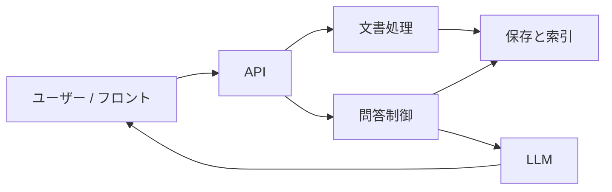
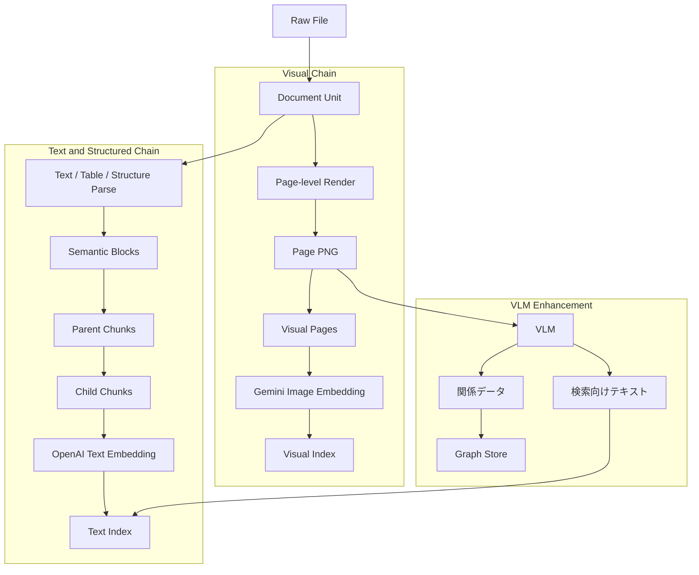
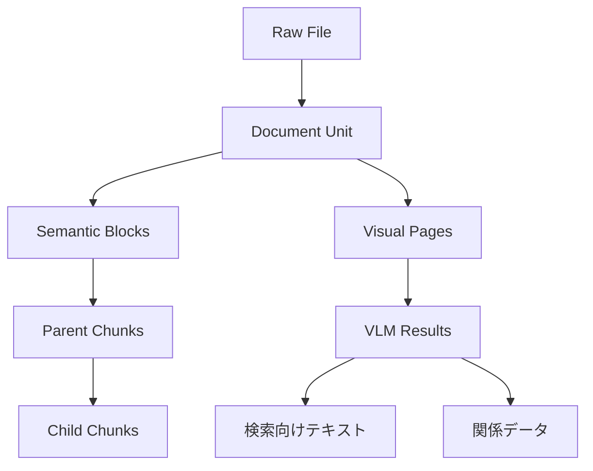
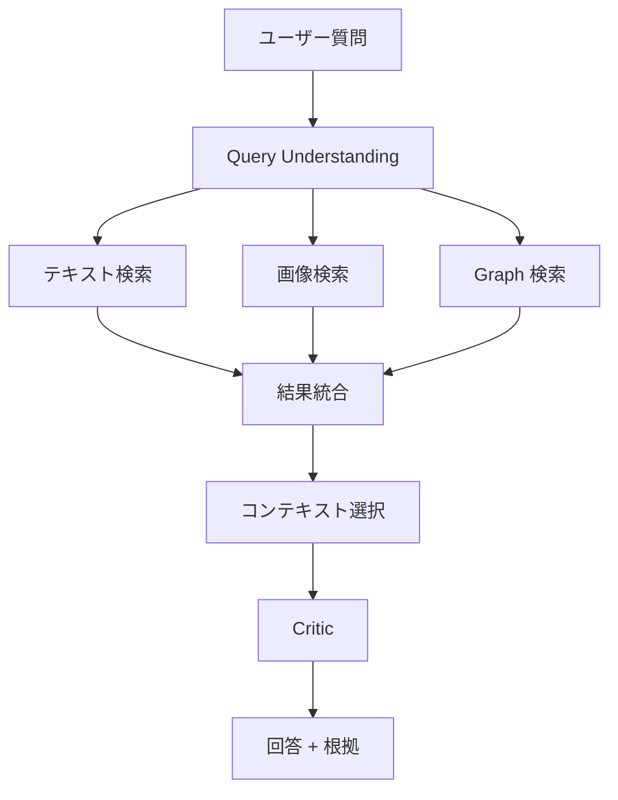
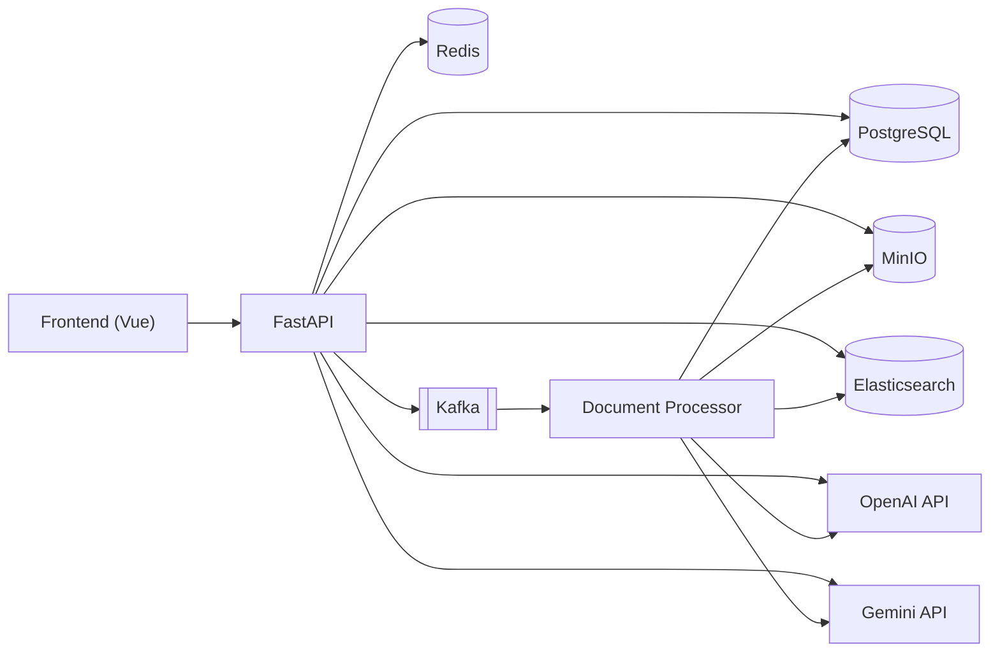
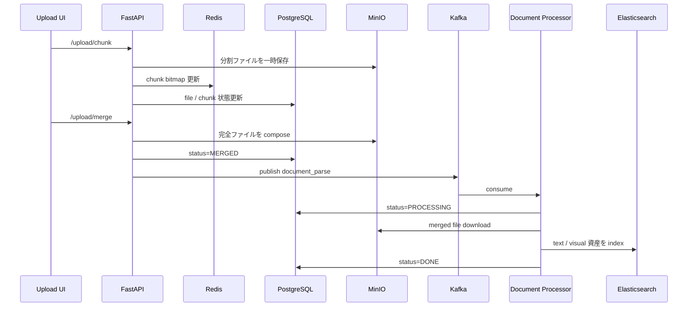
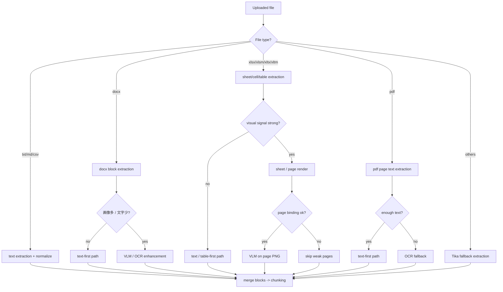
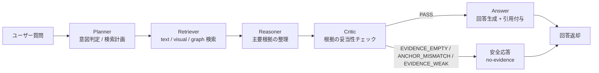
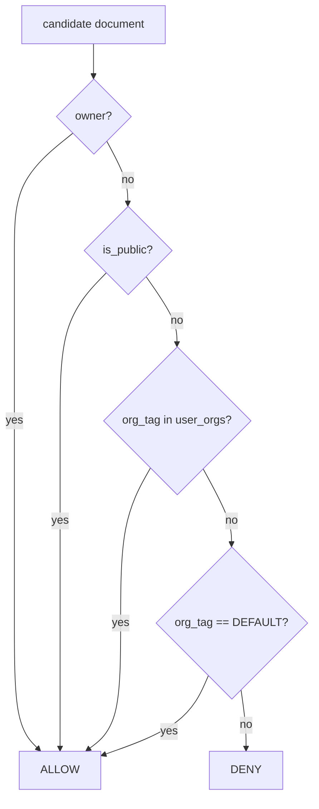

# AIナレッジベース基盤

[中文](./README.md) | [English](./README_en.md)

企業の文書には、文章だけでなく、画面レイアウト、フロー図、Excel 設計資料、スクリーンショットのような情報も多く含まれます。  
このプロジェクトは、そうした情報を一つの問い合わせ基盤にまとめて、テキスト検索・画像検索・関係検索を組み合わせて答えられるようにしたものです。

---

## このプロジェクトについて

まずは、このシステムが何をするものなのかをざっくり掴めるようにしています。  
初めて見る方でも、普通の RAG とどこが違うのかをすぐ追える構成です。

- 企業内文書向けのマルチモーダル AI ナレッジベース基盤です。
- PDF、Word、Excel、PPT、画像と、その中に含まれる表、ページ、スクリーンショット、フロー図、画面遷移図を扱います。
- 返すのは回答本文だけではなく、テキスト根拠、関連ページ画像、必要に応じた関係情報です。
- 一般的な「テキスト分割 + ベクトル検索 + LLM」に加えて、ページ単位の画像検索、必要なページだけの VLM 補強、Graph 検索を入れている点が特徴です。

---

## 入力と出力

ここでは、何を入れて何が返ってくるのかを先に整理します。  
ここを押さえておくと、後ろの図がかなり読みやすくなります。

### 入力

- 企業文書
- 設計書、運用手順書
- 画面定義、画面遷移図
- Excel 設計資料
- スクリーンショット、フロー図、図表

### 出力

- 根拠付きの回答
- 参照したテキスト
- 関連ページ画像
- 必要に応じた Graph 根拠

---

## 用語早見表

後ろで何度も出てくる言葉を、先にそろえておきます。  
最初に意味が分かっていると、図や処理の流れを追いやすくなります。

| 用語 | 意味 |
|---|---|
| Document Unit | 文書の元の単位。page、sheet、section、slide など |
| Semantic Block | 解析後の意味単位。段落、表行、要約など |
| Parent Chunk | 回答時に使う大きめの文脈単位 |
| Child Chunk | 検索時に使う細かい単位 |
| Visual Page | ページ単位の画像資産 |
| Text Index | テキスト検索用インデックス |
| Visual Index | 画像検索用インデックス |
| VLM | 画像を見てページの意味を取り出すモデル |
| Graph Facts | 関係情報から整理した node / edge データ |
| Dynamic Context Selection | 質問に応じて LLM に渡す証拠を切り替える仕組み |

---

## 全体の構成

まずは細部ではなく、システム全体の見取り図を見ます。  
ここでは「どんな大きな部品があるか」が掴めれば十分です。



### この図の見方

- 文書アップロード後は文書処理に流れます。
- 解析された結果は保存層と索引層に入ります。
- 質問時には問答制御がそこから証拠を取り出し、LLM に渡します。

### この図に対応する主な技術

- API / backend: FastAPI
- 非同期処理: Kafka
- オブジェクト保存: MinIO
- メタデータ / ACL: PostgreSQL
- Graph: PostgreSQL + Apache AGE
- 索引: Elasticsearch
- テキスト埋め込み: OpenAI
- 画像埋め込み: Gemini

---

## 文書がどうやって検索対象になるか

ここでは、1つの文書が中でどんな検索資産に変わるかを見ます。  
この部分が、普通の text-only RAG との一番大きな違いです。



### この図で一番大事なポイント

1. まず文書をページ単位の画像にそろえて、画像検索の土台を作ること  
2. VLM は前提ではなく補強で、必要なページだけに使うこと

---

## システムの中のデータの層

ここでは、なぜ block、chunk、visual page といった層があるのかを説明します。  
何でも一気にベクトル化するのではなく、役割ごとに層を分けています。



### なぜこう分けているのか

- Document Unit は元の page / sheet 位置を保ちます。
- Semantic Block は意味の最小単位です。
- Child Chunk は検索用、Parent Chunk は回答用の少し大きい文脈です。
- Visual Page はページ画像の単位です。
- VLM の出力は、そのまま混ぜずにテキスト側と Graph 側に分けます。

---

## 質問してから回答するまで

ここでは、質問が入ってから回答が返るまでの流れを追います。  
ポイントは、検索した結果をそのまま LLM に渡すのではなく、いったん整理してから使うことです。



### ここでやっていること

- 質問は text / visual / graph の三つの経路で検索します。
- 候補を取ったあと、すぐに LLM に投げるのではなく、いったんまとめます。
- そのうえで、質問内容に合わせて、テキスト中心にするか、画像を足すか、Graph を使うかを切り替えます。

---

## なぜ一つのモデルに全部任せないのか

ここでは、あえて役割を分けている理由を説明します。  
企業文書では、情報の種類がかなり違うので、一つの方法で全部を処理しようとすると無理が出やすいです。

- 文章やルール説明はテキスト側が向いています。
- 画面レイアウトやスクリーンショットは画像側が向いています。
- 遷移関係や依存関係は Graph が自然です。
- VLM は便利ですが、全部に使う前提にするとコストも不安定さも増えます。

そのため、このプロジェクトでは、最初から役割を分けて最後にまとめる形を取っています。

---

## 主な技術

図の中に細かい技術を全部入れると見づらくなるので、ここでまとめます。  
初めて見る場合は、このセクションを見るだけでも大枠が分かります。

- API / backend: FastAPI, WebSocket
- 非同期処理: Kafka
- メタデータ / ACL / 状態管理: PostgreSQL
- Graph: PostgreSQL + Apache AGE
- オブジェクト保存: MinIO
- キャッシュ: Redis
- 検索: Elasticsearch
- テキスト埋め込みとチャット: OpenAI
- 画像埋め込み: Gemini
- 画像理解: VLM
- 実行環境: Docker, Docker Compose

---

## はじめ方

最初に動かすための最小手順だけをここにまとめます。  
細かな設定は `.env.example` を見た方が早いです。

### 1. 設定ファイルを作る

```bash
cp .env.example .env
```

### 2. 最低限設定するもの

- `OPENAI_API_KEY`
- `GEMINI_API_KEY`
- DB / Redis / MinIO / Elasticsearch のパスワード

> `.env` は Git に入れないでください。実際の鍵はローカルだけに置く前提です。

### 3. 起動

```bash
cd app
./start_docker.sh pg up
```

### 4. 動作確認

```bash
curl http://localhost:8000/health
```

### 5. 停止

```bash
cd app
./start_docker.sh pg down
```

---

## よく見る環境変数

最初に全部覚える必要はありません。  
まずはここにある変数だけ見ておけば、立ち上げや全体像の理解には十分です。

### Text / Chat

- `OPENAI_API_KEY`
- `OPENAI_EMBEDDING_MODEL`
- `OPENAI_CHAT_MODEL`

### Visual Embedding

- `GEMINI_VISUAL_EMBEDDING_ENABLED`
- `GEMINI_VISUAL_EMBEDDING_BACKEND=ai_studio|vertex|auto`
- `GEMINI_VISUAL_EMBEDDING_MODEL`
- `GEMINI_VISUAL_EMBEDDING_DIMENSIONS`
- `GEMINI_API_KEY`

### Graph

- `GRAPH_BACKEND=postgres_relational|postgres_age`
- `POSTGRES_AGE_ENABLED=true|false`
- `POSTGRES_AGE_GRAPH_NAME=knowledge_graph`

---

## 現在の到達点

ここでは、今どこまで動いているかをまとめます。  
評価したい方は、ここを見ると状態が掴みやすいです。

### できていること

- テキスト検索の流れ
- ページ単位画像と画像埋め込みの流れ
- Gemini 画像埋め込み
- VLM 結果の text / graph 分流
- PostgreSQL + AGE の Graph backend
- 動的なコンテキスト切り替え

### 今後さらに良くできること

- quality status を検索制御にもっと強く使う
- page-level render をさらに安定させる
- Graph retrieval を主経路に近づける
- 評価と回帰の仕組みを強くする

---

## 設計意図とアーキテクチャ補足

ここまでの内容は、初めて見る人が全体像をつかむための説明です。  
このセクションから先は、面接・技術レビュー・設計議論向けに、もう少し踏み込んだ説明をまとめています。

### 設計目標

- 文書アップロードから Q&A までを一気通貫で提供する
- 権限境界を検索段階で強制する
- 画像や図表を含む文書でも回答精度を落とさない
- 評価データをためて改善サイクルを回せるようにする

### もう少し詳しい全体アーキテクチャ

この図は、API、非同期処理、保存先、索引、外部モデルのつながりを見せるためのものです。  
高レベル図より一段細かいですが、まだ実装詳細までは入れていません。



### アップロードと解析の流れ

ここでは、ファイルアップロード後に内部で何が起きるかを時系列で示します。  
解析は同期で抱え込まず、非同期パイプラインに流しています。



### この設計で意識していること

- 解析を同期で実行しない：
  - API を重くしすぎず、長時間処理のタイムアウトを避けるため
- PostgreSQL と Elasticsearch を分ける：
  - 管理・監査と検索性能の役割を分けるため

### 対応ファイル形式と解析方針

| 種別 | 主な拡張子 | 解析方式 | 補足 |
|---|---|---|---|
| Plain text | `txt`, `md`, `csv` | テキスト抽出 + 正規化 | 軽量・高速 |
| Office text | `docx` | block 抽出 + 必要時 VLM / OCR | 表と段落を優先 |
| Spreadsheet | `xlsx`, `xlsm`, `xltx`, `xltm` | cell / table 抽出 + ページ画像 + 必要に応じて VLM | レイアウト・遷移図の主要対象 |
| PDF | `pdf` | ページ抽出 + 必要時 OCR | テキスト層が弱いページにフォールバック |
| Fallback | その他 | Tika fallback | 最後の保険 |

### 解析ルーティング

まず text-first を基本にして、必要なときだけ OCR / VLM を足す形にしています。  
全部を最初から重い処理に流さないことが、このプロジェクトの考え方です。



### Chunking と構造化

- `chunk_size = 900`
- `chunk_overlap = 120`
- ねらい：
  - 長めの文脈をある程度保つ
  - 切れ目による情報欠損を和らげる

主な block は次の通りです。

| block/source type | 生成元 | 用途 |
|---|---|---|
| `paragraph`, `section` | 本文抽出 | 一般的な回答 |
| `table_row`, `table_header` | xlsx / docx 表 | 項目照会、条件比較 |
| `xlsx_image`, `vlm_sheet_snapshot`, `vlm_diagram` | 画像 / ページ画像 / VLM | レイアウト、遷移図、図解説明 |
| `relation_node`, `relation_edge` | 関係抽出 | 関係検索、遷移説明 |

### VLM 結果の扱い

- VLM の結果はそのまま全部を検索に入れません
- 目的ごとに分けています
  - raw payload
  - 検索向けテキスト
  - 関係データ
- `image_path` や `sheet/page/source_parser` を残して、後から証跡を追えるようにしています

### 問答と検索の主経路

面接やレビューでは、この流れを見せると伝わりやすいです。  
単に検索して答えるのではなく、途中で整理と判定を入れているのがポイントです。



### この流れでやっていること

- Planner:
  - 今回の質問で、どの検索経路を重く使うか決める
- Retriever:
  - text / visual / graph の三路で候補を取る
- Reasoner:
  - そのままではなく、先に根拠を整理する
- Critic:
  - 根拠不足なら答えずに止める

現在の Critic は、主に次の判定を返します。

- `EVIDENCE_EMPTY`：十分な根拠が見つからない
- `ANCHOR_MISMATCH`：質問対象と根拠が噛み合っていない
- `EVIDENCE_WEAK`：根拠はあるがまだ弱い
- `PASS`：回答生成に進める

### 権限モデル（ACL）

権限は回答の最後ではなく、検索段階でかけています。  
今は次の条件を OR で見ています。

- `owner`
- `public`
- `org`
- `default`



### Kafka の信頼性設計

- 同一 group の複数 consumer で並列処理
- `file_md5 + user_id` 単位の処理ロック
- done marker で重複メッセージをスキップ
- リトライ上限超過時は DLQ に退避

ねらいは次の二つです。
- 重複インデックスを防ぐ
- 毒メッセージで主キュー全体が詰まるのを避ける

### 評価の考え方

評価は二層で見ています。

1. オンライン評価
   - 実運用ログ
   - no-evidence、error、latency、source count などを見る
2. オフライン評価
   - 固定データセットで回帰確認
   - recall、precision、faithfulness、completeness、coverage を見る

ここを分けているのは、日々の挙動確認と再現可能な比較を両立させるためです。

---

## 関連ドキュメント

README で全体像を掴んだあとに見ると分かりやすい資料です。  
より実装寄りの内容は、こちらにまとまっています。

- `docs/graph_store_zh.md`（Graph backend の補足メモ / 中国語）
- `docs/architecture_ja.md`
- `docker-compose.postgresql.yml`
- `.env.example`

---

## ひとことで言うと

文章、ページ画像、関係情報を一つの企業向け問い合わせ基盤にまとめたプロジェクトです。
