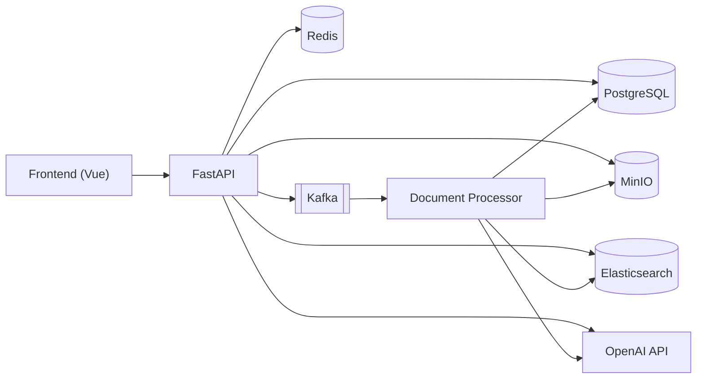
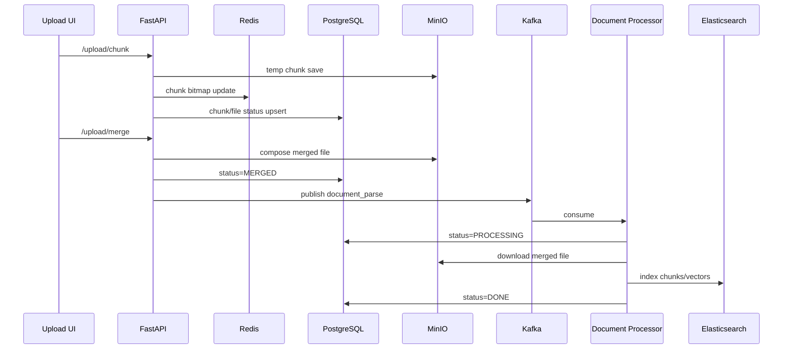
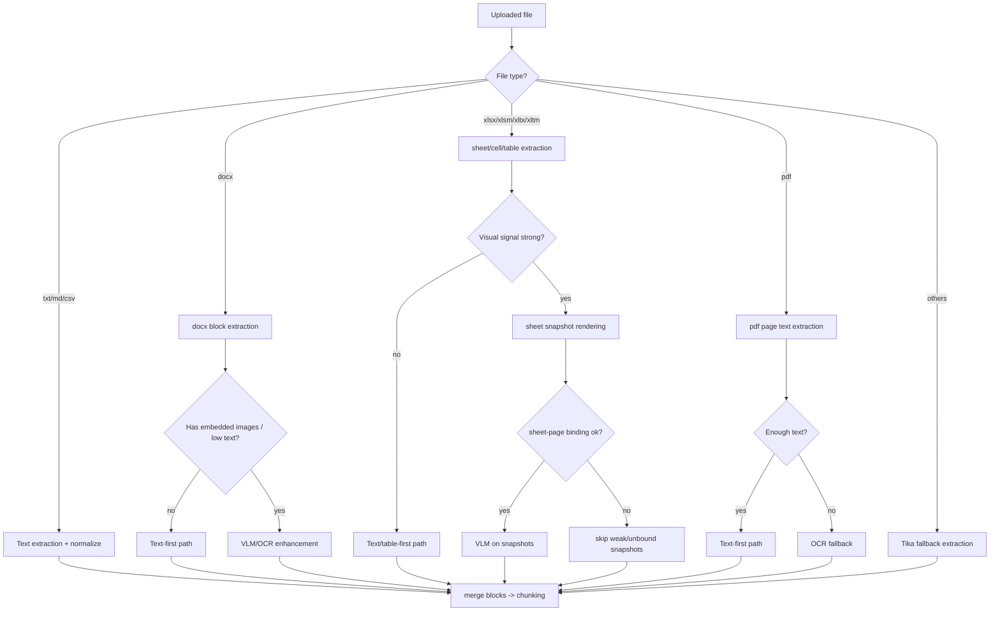
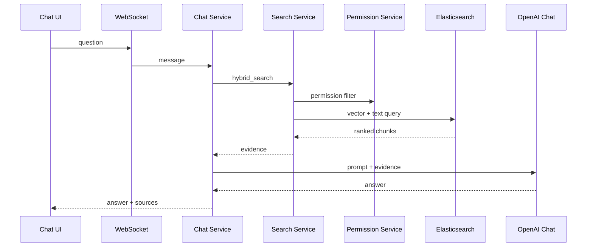
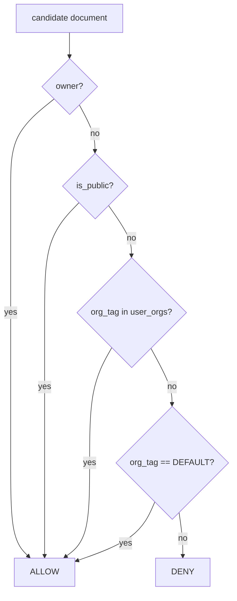

# Architecture Notes (Japanese)

本ドキュメントは、利用手順ではなく「設計意図とトレードオフ」を説明するための資料です。  
面接・技術レビュー・導入検討時に参照してください。

## 1. 設計目標
- 文書アップロードからQ&Aまでを一気通貫で提供する
- 権限境界（組織/公開/所有者）を検索段階で強制する
- 画像/図表を含むドキュメントでも回答精度を維持する
- 評価データを蓄積し、改善サイクルを回せるようにする

## 2. 全体アーキテクチャ

## 3. Upload/Parse Pipeline

### トレードオフ
- 解析を同期実行せず Kafka 非同期にした理由:
  - API応答を軽くし、長時間処理でタイムアウトしない設計にするため
- DB/ES 二重書き込みの理由:
  - 検索性能（ES）と運用管理/監査（DB）を分離するため

## 4. 対応ファイル形式と解析方針

| 種別 | 主な拡張子 | 解析方式 | 補足 |
|---|---|---|---|
| Plain text | `txt`, `md`, `csv` | テキスト抽出 + 正規化 | 軽量・高速。構造化は限定的 |
| Office text | `docx` | docxブロック抽出 + 必要時VLM/OCR補強 | 表・段落ベースで分割 |
| Spreadsheet | `xlsx`, `xlsm`, `xltx`, `xltm` | セル/表行抽出 + 図形/画像抽出 + シート快照VLM | レイアウト・遷移図系の主要対象 |
| PDF | `pdf` | ページ抽出 + OCR（必要時） | テキスト取得困難ページはOCRフォールバック |
| Fallback | その他Office系等 | Tika抽出（from_buffer） | 解析不能時の最終フォールバック |

VLM適用は常時ではなく、文書特性に応じてルーティングします。  
例: 画像シグナルが強い xlsx / 画像内包 docx / 低文字量ページ。

### 4.1 解析ルーティング（Text / OCR / VLM）

要点:
- まず text-first を基本とし、必要条件が成立した場合のみ OCR/VLM を追加します。  
- xlsx は快照の sheet-page バインド品質を確認し、低信頼結果は取り込まない方針です。  
- VLM由来データは必ず `image_path` と紐付けて証跡性を担保します。

## 5. 分割（Chunking）と構造化（Structuring）

### 5.1 Chunkingポリシー
- `chunk_size = 900` 文字
- `chunk_overlap = 120` 文字
- 目的:
  - 長文コンテキストを保ちつつ検索効率を確保
  - 境界欠損を overlap で緩和

### 5.2 構造化単位（主要 block）

| block/source type | 生成元 | 用途 |
|---|---|---|
| `paragraph`, `section` | 本文抽出 | 一般RAG回答 |
| `table_row`, `table_header` | xlsx/docx表 | 項目照会・条件比較 |
| `xlsx_image`, `vlm_sheet_snapshot`, `vlm_diagram` | 画像/快照/VLM | レイアウト・遷移図・図解説明 |
| `relation_node`, `relation_edge` | 図形/関係抽出 | 関係検索・遷移説明 |

### 5.3 VLM結果の取り扱い
- VLM由来 block は `image_path` を必須で紐付け（根拠画像トレース用）
- `sheet/page/source_parser/match_confidence` を保持し、後段の証跡表示に利用
- 低信頼マッチや未バインド快照はスキップ可能（品質優先）

## 6. 入庫・索引マッピング（どこに何を保存するか）

### 6.1 Object Storage (MinIO)
- 原本: `documents/{user}/{file}`
- 分割アップロード一時領域: `temp/{md5}/{idx}`
- 画像/快照: `.../images/...`（解析時生成）

### 6.2 RDB (PostgreSQL)

| テーブル | 役割 |
|---|---|
| `file_upload` | ファイル状態管理（UPLOADING/MERGED/PROCESSING/DONE/FAILED） |
| `chunk_info` | 分割アップロード整合性管理 |
| `document_vectors` | chunkテキストのDB側メタ |
| `chunk_sources` | chunkと根拠（sheet/page/image_path）対応 |
| `table_rows` | 表形式データの行レベル構造化 |
| `image_blocks` | 画像ブロックと説明・位置メタ |
| `relation_nodes`, `relation_edges` | 図・遷移関係の構造化 |
| `chat_usage_events` | オンライン利用ログ（評価母集団） |
| `eval_*` | オフライン評価実行結果（後述） |

### 6.3 Elasticsearch
- `text_content`（全文検索）
- `dense_vector`（ベクトル検索）
- ハイブリッド統合後に上位 `top-k` を回答生成へ渡す

## 7. Q&A / Retrieval Pipeline

### トレードオフ
- ベクトル検索のみを採用しない理由:
  - 固有語や短語クエリに弱いケースを全文検索で補完するため
- 召回後に根拠を返す理由:
  - 説明可能性（Why this answer）を担保するため

## 8. 権限モデル（RCL）

判定は検索時に `OR` 条件で適用:
- `owner`: 自分がアップロードした文書
- `public`: 全体公開文書
- `org`: 自分の所属組織タグと一致
- `default`: 共有既定タグ（運用方針で利用）

## 9. 信頼性設計（Kafka）

### 実装ポイント
- 複数コンシューマ（同一 group）で並列処理
- file_md5 + user_id 単位の処理ロック（Redis）
- done marker による重複メッセージのスキップ
- リトライ上限超過時は DLQ へ退避

### ねらい
- 重複インデックス防止
- 毒メッセージで主キューが詰まることを回避

## 10. 評価体系（オンライン/オフライン）

### 10.1 オンライン評価（実運用ログ）
- データ源: `chat_usage_events`
- 主な保存項目:
  - `question_text`, `answer_text`, `intent`
  - `retrieval_count`, `source_count`, `status`, `latency_ms`
  - `source_snapshot`（召回根拠のスナップショット）
- 目的:
  - 実ユーザー質問で no_evidence/error 傾向を把握
  - 遅延悪化や意図ルーティング漏れを検知

### 10.2 オフライン評価（再現可能な実験）
- 実行単位: `eval_runs`
- 指標: `eval_metrics`
- 用例判定: `eval_cases`
- 根拠妥当性: `eval_evidences`
- 資産カバレッジ: `eval_asset_coverages`

### 10.3 コア指標
- Recall: 正解文書が召回集合に含まれる率
- Precision: 召回上位が関連文書である率
- Faithfulness: 回答が根拠から逸脱していない率
- Completeness: 必須要点の欠落がない率
- Coverage: 資産総量に対するインデックス化率（file/chunk/image）

### 10.4 運用上の見方
- 日次: online no_evidence率、error率、P95 latency
- 週次: offline run の pass_rate と coverage_rate 推移
- 改善時: 変更前後で同一データセット比較（回帰検知）

## 11. 今後の拡張
- 役割階層を含む RBAC/ABAC への拡張
- 可観測性（メトリクス/トレース/アラート）強化
- HA 構成テンプレート（Kafka/ES/DB 冗長化）
